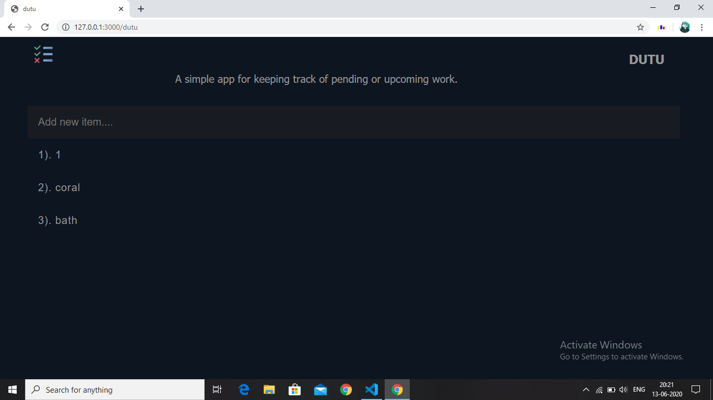
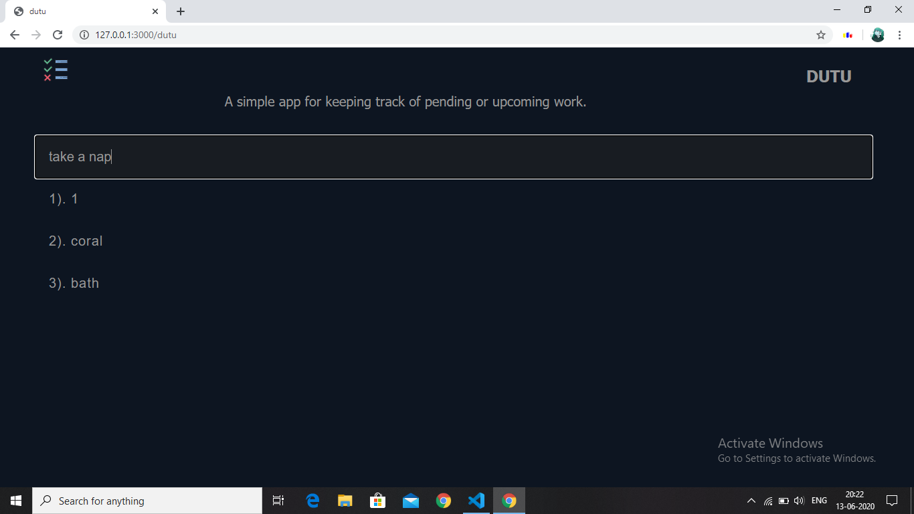
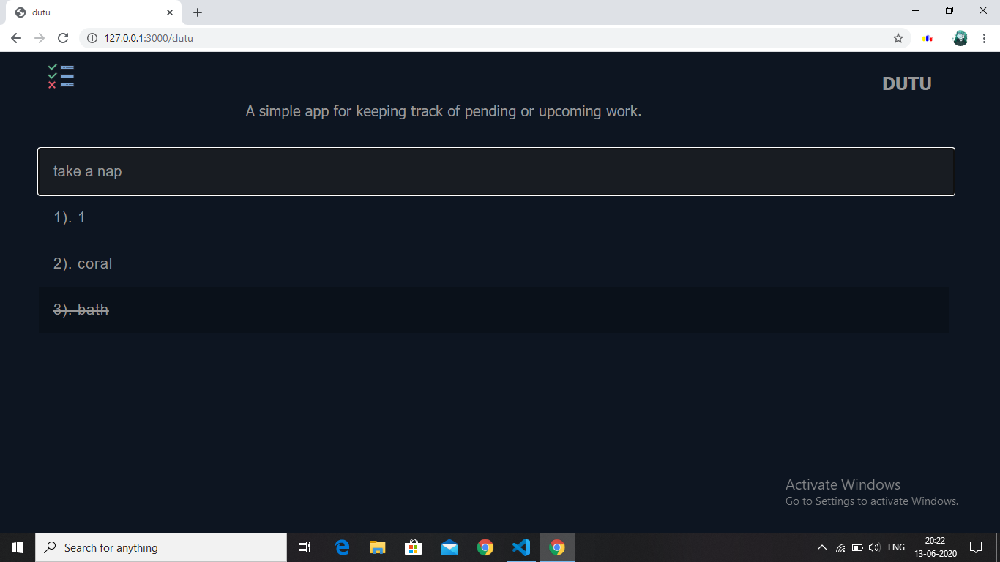

# Dutu
Its a simple To Do App made with node.js
# These are some sample snaps of my DUTU project.

  

# ------

  

# ------

  

Instructions for running this project locally. 

1.Install all dependent modules given in package.json 
  a)npm install express 
  b)npm install ejs 
  c)npm install body-parser 
  d)npm install mongoose  
  
2.Use command -- node index to run entry file. 

3.Run at local host. 
